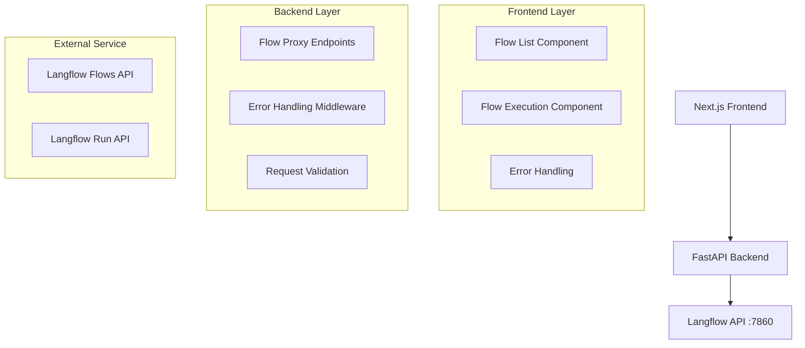

# Design Document

## Overview

The Langflow Integration PoC consists of a FastAPI backend service that acts as a proxy/bridge between a Next.js frontend and the Langflow API running on localhost:7860. The architecture follows a three-tier pattern: Frontend (Next.js) → Backend (FastAPI) → Langflow API.

## Architecture



## Components and Interfaces

### Backend Components (FastAPI)

#### 1. Flow Service
- **Purpose**: Handle communication with Langflow API
- **Methods**:
  - `get_flows()`: Retrieve flows from Langflow
  - `execute_flow(flow_id, input_data)`: Execute a specific flow
- **Error Handling**: Timeout, connection errors, HTTP errors

#### 2. API Endpoints
- `GET /api/flows`: Proxy to Langflow flows endpoint
- `POST /api/flows/{flow_id}/execute`: Proxy to Langflow run endpoint

#### 3. Models/Schemas
```python
class FlowResponse(BaseModel):
    id: str
    name: str
    description: str
    tags: List[str]
    is_component: bool
    mcp_enabled: bool

class FlowExecutionRequest(BaseModel):
    input_value: str
    output_type: str = "chat"
    input_type: str = "chat"
    tweaks: Dict[str, Any] = {}

class FlowExecutionResponse(BaseModel):
    success: bool
    result: Any
    error: Optional[str] = None
```

### Frontend Components (Next.js)

#### 1. Flow List Component
- **Purpose**: Display available Langflow flows
- **Features**:
  - Grid/list view of flows
  - Search and filter functionality
  - Flow selection

#### 2. Flow Execution Component
- **Purpose**: Handle flow execution interface
- **Features**:
  - Input form for flow parameters
  - Loading states
  - Result display
  - Error handling

#### 3. API Client Service
- **Purpose**: Handle HTTP communication with backend
- **Methods**:
  - `fetchFlows()`: Get list of flows
  - `executeFlow(flowId, params)`: Execute flow

## Data Models

### Flow Data Structure
Based on the provided example:
```typescript
interface Flow {
  id: string;
  name: string;
  folder_id: string;
  is_component: boolean;
  endpoint_name: string | null;
  description: string;
  data: any | null;
  access_type: string;
  tags: string[];
  mcp_enabled: boolean;
  action_name: string | null;
  action_description: string | null;
}
```

### Execution Request Structure
```typescript
interface ExecutionRequest {
  input_value: string;
  output_type: "chat" | "text";
  input_type: "chat" | "text";
  tweaks: Record<string, any>;
}
```

## Error Handling

### Backend Error Handling
1. **Connection Errors**: Retry logic with exponential backoff
2. **HTTP Errors**: Map Langflow errors to appropriate HTTP status codes
3. **Validation Errors**: Return 400 with detailed error messages
4. **Timeout Errors**: Return 504 Gateway Timeout

### Frontend Error Handling
1. **Network Errors**: Display user-friendly messages with retry options
2. **Validation Errors**: Show field-specific error messages
3. **Server Errors**: Display generic error message with support contact
4. **Loading States**: Show spinners and disable interactions during requests

## Testing Strategy

### Backend Testing
1. **Unit Tests**:
   - Flow service methods
   - Request/response validation
   - Error handling scenarios

2. **Integration Tests**:
   - API endpoint functionality
   - Langflow API integration (with mocking)

### Frontend Testing
1. **Component Tests**:
   - Flow list rendering
   - Flow execution form
   - Error state handling

2. **Integration Tests**:
   - API client functionality
   - End-to-end flow execution

### API Testing
1. **Mock Langflow responses** for consistent testing
2. **Error scenario testing** (network failures, invalid responses)
3. **Performance testing** for concurrent requests

## Security Considerations

1. **Input Validation**: Sanitize all user inputs before sending to Langflow
2. **Rate Limiting**: Implement rate limiting to prevent API abuse
3. **CORS Configuration**: Properly configure CORS for frontend-backend communication
4. **Error Information**: Avoid exposing sensitive error details to frontend

## Performance Considerations

1. **Caching**: Cache flow list for short periods to reduce Langflow API calls
2. **Connection Pooling**: Use HTTP connection pooling for Langflow API calls
3. **Async Operations**: Use async/await for all API operations
4. **Request Timeouts**: Set appropriate timeouts for Langflow API calls